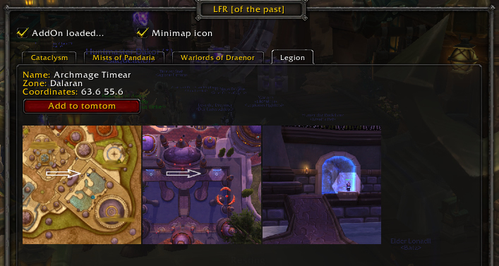
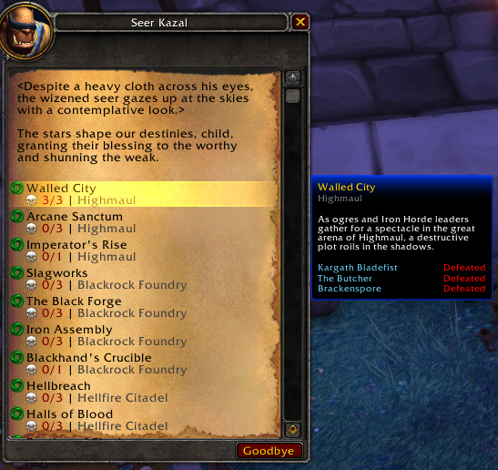
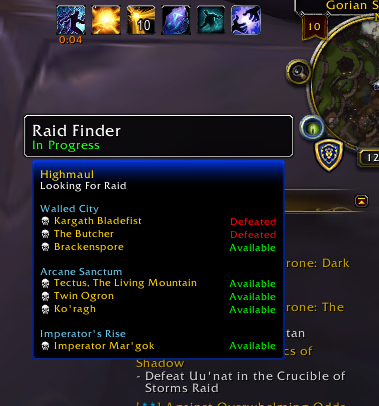

# LFR \[of_the_past\] (WoW AddOn)

&nbsp; &nbsp; &nbsp; &nbsp;

## Description
Blizzard added some NPCs to provide access to older LFR instances. This addon should help you to find them.

When you talk to one of the npcs this addon replaces the text lines with instance name, wing names and encounter status.

Inside the LFR instances appends this addon a second tooltip under the instance eye tooltip on the minimap with a list of encounters separated by LFR wing.

## Bug reports, feature requests and Support
* [Bug reports & feature requests on Github](https://github.com/HizurosWoWAddOns/LFR_of_the_past/issues)
* [Comments & Criticism on Curseforge](https://www.curseforge.com/wow/addons/lfr-of-the-past)

## Localization
Do you want to help translate this addon?
See [Curseforge localization tool](https://www.curseforge.com/wow/addons/lfr-of-the-past/localization)

## Hizuro's projects
* On [Curseforge](https://www.curseforge.com/members/hizuro_de/projects)
* On [Github](https://github.com/HizurosWoWAddOns)

## Disclaimer
> World of Warcraft© and Blizzard Entertainment© are all trademarks or registered trademarks of Blizzard Entertainment in the United States and/or other countries. These terms and all related materials, logos, and images are copyright © Blizzard Entertainment.
